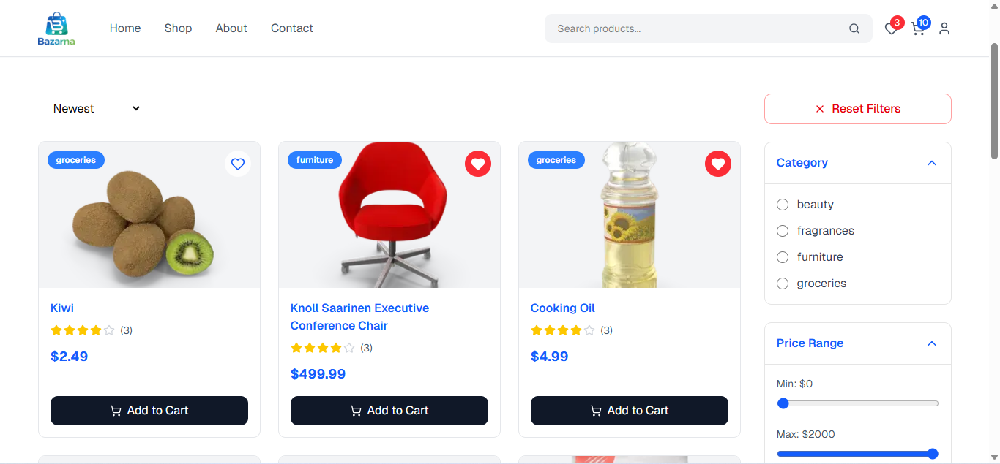
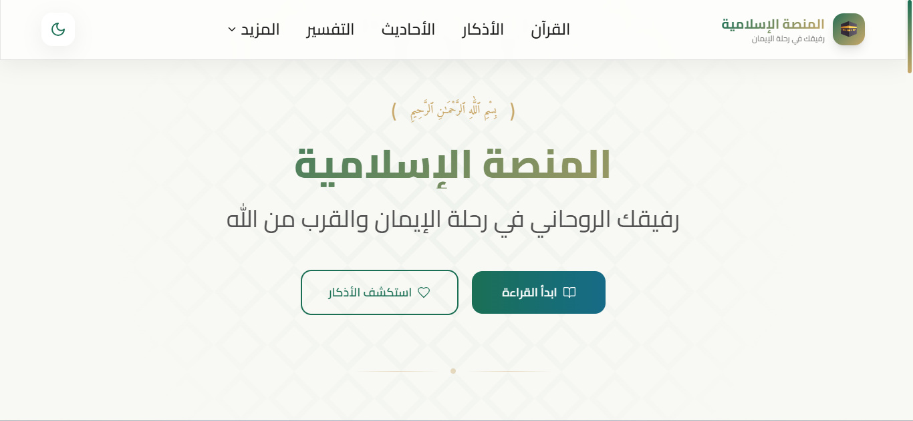
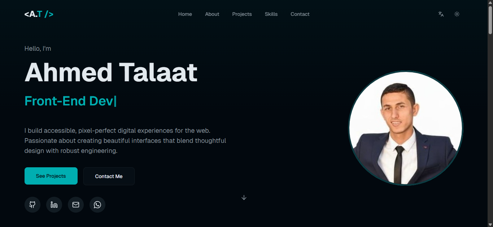

# 👋 Hey, I'm Ahmed Talaat

### 🚀 Front-End Developer | React & Next.js Developer | UI Enthusiast

Passionate about building modern, responsive, and user-friendly web applications using the latest front-end technologies.  
I enjoy transforming ideas into interactive digital experiences with clean code and creative UI design.

  
  
  
  
  
  
  

---

<h3>About Me</h3>

<ul>
  <li>🚀 Passionate <b>Front-End Developer</b> focused on building modern, responsive, and user-friendly web applications.</li>
  
  <li>💻 Currently working with <b>React, Next.js, TypeScript, Tailwind CSS, and JavaScript</b> while continuously improving my development skills.</li>
  
  <li>🎯 Experienced in creating both <b>personal and client projects</b> with clean code and scalable UI design.</li>
  
  <li>📚 Always learning new technologies and best practices to grow as a professional developer.</li>
  
  <li>🌟 Interested in crafting smooth user experiences and high-performance web applications.</li>
</ul>

---

<h3>Skills</h3>

  
  
  
  
  
  
  
  
  
  
  
  
  
  
  
  
  
  
  
  
  
  
  
  
  

  

  
  
  
  
  

---

<h3>Experience</h3>

<table width="100%">

<tr>

<td valign="top" style="padding:20px;">

<h3>🎓 Front-End Instructor @ Masar Academy</h3>

📅 <b>Apr 2026 - May 2026</b>

<ul>
<li> Taught Front-End fundamentals course focusing on JavaScript basics.</li>
<li> Explained core concepts like variables, functions, arrays, objects, loops, and DOM manipulation.</li>
<li> Helped students understand problem-solving using JavaScript through practical examples.</li>
<li> Prepared learning materials and guided students through exercises and projects.</li>
</ul>

</td>

</tr>

<tr>

<td valign="top" style="padding:20px;">

<h3>💼 Front-End Intern @ CodVeda Technologies</h3>

📅 <b>Mar 2026 - Apr 2026</b>

- Worked as a Front-End Intern at CodVeda Technologies. 
- Built and improved responsive UI components using HTML, CSS, JavaScript, and React. 

</td>

</tr>

</table>

---

<h3>Portfolio</h3>

<table width="100%">
<tr>

<td width="33%" valign="top" style="padding:20px;">

<h3 align="center">Bazarna Store 🛒</h3>

A modern and responsive e-commerce website with product pages, shopping cart functionality, and clean UI design built using React and Next.js.

  

  

</td>

<td width="33%" valign="top" style="padding:20px;">

<h3 align="center">Al Manasah Al Islamiya 🕋</h3>

An Islamic platform that provides access to Qur’an, Hadith, Tafsir, Azkar, and daily reminders with a modern and user-friendly experience.

  

  

</td>

<td width="33%" valign="top" style="padding:20px;">

<h3 align="center">Ahmed Portfolio 🚀</h3>

A personal portfolio website showcasing projects, skills, and services with a clean modern design and responsive layout.

  

  

</td>

</tr>
</table>

---

<h3>Where to find me</h3>

   
   

------------

<b>Ahmed Talaat</b> | Front-End Developer

